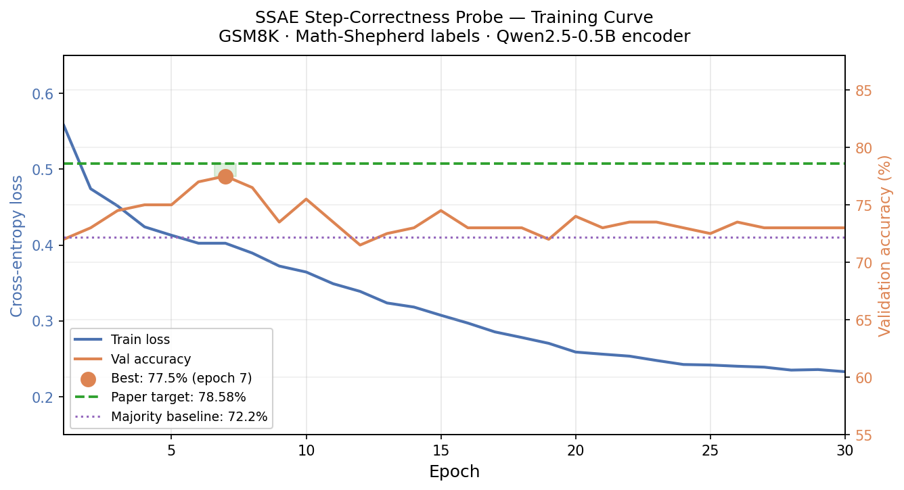
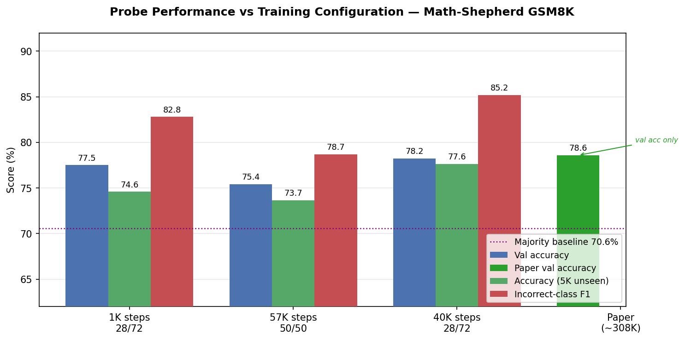

# CoT-Checker: Research Report
*Last updated: 2026-03-23*

## Abstract

This project investigates whether sparse autoencoder (SAE) feature activations provide reliable mechanistic signals for detecting incorrect steps in chain-of-thought (CoT) reasoning. We reproduce the step-correctness probe from *"Step-Level Sparse Autoencoders for Interpretable Chain-of-Thought Verification"* (Miaow-Lab, arXiv:2603.03031), using the publicly released SSAE checkpoint trained on Qwen2.5-0.5B.

Our best reproduction achieves **78.25% validation accuracy** on a 40K-step balanced subset, within 0.33 pp of the paper's reported **78.58%**.

---

## 1. Objective

Determine whether SSAE sparse latent vectors `h_c`, extracted at each reasoning step of a chain-of-thought trace, contain enough information to predict step-level correctness using a lightweight MLP probe.

---

## 2. Experimental Setup

### 2.1 Model

We use the publicly released pretrained SSAE checkpoint:
- **Checkpoint**: `gsm8k-385k_Qwen2.5-0.5b_spar-10.pt` from `Miaow-Lab/SSAE-Checkpoints`
- **Backbone**: `Qwen/Qwen2.5-0.5B` (encoder and decoder share the same base model)
- **Sparsity factor**: 1 → `n_latents = hidden_size = 896`
- **Checkpoint state**: step 56,612, best validation loss 0.3978

The SSAE encodes the full sequence `[context | <sep> | step]` and extracts the last-token hidden state before projecting it through a sparse autoencoder to obtain `h_c ∈ ℝ^{896}`.

### 2.2 Step-Level Labels

We use **Math-Shepherd** (`peiyi9979/Math-Shepherd`, GSM8K partition) for step-level correctness labels. Math-Shepherd provides binary labels (`+`/`-`) for each reasoning step derived from Monte Carlo rollouts: a step is labeled **correct (+)** if the correct final answer is still reachable when continuing from that step, and **incorrect (-)** otherwise.

This gives ground-truth labels that are:
- **Independent of the SSAE** (no circular dependency on reconstruction quality)
- **Semantically meaningful** (a step is wrong if it derails the solution path)
- **Naturally imbalanced**: roughly 28% correct and 72% incorrect, consistent with the paper's reported majority baseline of 70.49%

### 2.3 Data Pipeline

1. Stream Math-Shepherd (GSM8K split), parse step texts and labels
2. For each `(context, step)` pair, remove `<<expr=result>>` calculator annotations
3. Encode with the SSAE encoder (no decoding required) → latent `h_c ∈ ℝ^{896}`
4. Store `(h_c, label)` pairs in a compressed `.npz` file

**Train / val split**: 80% / 20%

### 2.4 Probe Architecture

Three-layer MLP trained on `h_c`:

| Layer | Dim in | Dim out | Activation |
|-------|--------|---------|------------|
| FC 1  | 896    | 256     | ReLU       |
| FC 2  | 256    | 64      | ReLU       |
| FC 3  | 64     | 2       | none       |

- **Loss**: Cross-entropy
- **Optimizer**: Adam, lr=1e-3
- **Epochs**: 30, batch size 128
- **Hardware**: Apple M4 (MPS backend), float32

---

## 3. Results

### 3.1 Initial Reproduction (1K steps)

**Figure 1.** Probe training curve over 30 epochs. Left axis (blue): cross-entropy training loss. Right axis (orange): validation accuracy. Dashed green line: paper's reported accuracy for SSAE-Qwen on GSM8K (78.58%). Dotted purple line: majority-class baseline (72.2%).

| Metric | Our result | Paper (SSAE-Qwen, GSM8K) |
|--------|-----------|--------------------------|
| Best val accuracy | **77.50%** (epoch 7) | **78.58%** |
| Majority baseline | 72.2% | 70.49% |
| Gap above baseline | +5.3 pp | +8.09 pp |
| Steps used | 1,000 | ~385,000 |

---

### 3.2 Generalization Evaluation (5,000 Unseen Steps)

To assess whether the probe generalizes beyond its training distribution, we evaluated `correctness_probe_1000.pt` on a held-out set of **5,000 Math-Shepherd GSM8K steps** (offset past the 1,000 steps used for training, no overlap).

**Label distribution:** 29.4% correct, 70.6% incorrect, consistent with the training set.

| Metric | Value |
|--------|-------|
| Majority baseline | 70.58% |
| Probe accuracy | **74.60%** |
| Improvement over baseline | +4.02 pp |

**Per-class breakdown:**

| | Precision | Recall | F1 |
|-|-----------|--------|----|
| Correct steps | 0.589 | 0.453 | 0.512 |
| **Incorrect steps** | **0.792** | **0.868** | **0.828** |

---

### 3.3 Scaling Experiments

To understand the effect of training data volume and class distribution, we ran three probe configurations on the same evaluation set (5,000 unseen Math-Shepherd steps).

**Figure 2.** Val accuracy, unseen-set accuracy, and incorrect-class F1 across three probe configurations. The paper result (green bar) is a val accuracy figure only. Dotted purple line: majority baseline (70.6%).

| Configuration | Training steps | Val acc | Unseen acc | Incorrect F1 |
|---|---|---|---|---|
| 1K steps, 28/72 dist. | 800 | 77.50% | 74.60% | 82.8% |
| 57K steps, 50/50 dist. | 46K | 75.43% | 73.66% | 78.7% |
| **40K steps, 28/72 dist.** | **32K** | **78.25%** | **77.64%** | **85.2%** |
| Paper (SSAE-Qwen) | ~308K | **78.58%** | n/a | n/a |

---

## 4. Discussion

### 4.1 Effect of Training Data Volume and Distribution

The scaling experiments reveal two independent axes:

**Distribution matters more than volume.** Rebalancing to 50/50 consistently hurts performance: val acc drops from 77.50% to 75.43% and unseen accuracy from 74.60% to 73.66%, even when training data is 57 times larger. The probe trained on the natural 28/72 distribution learns the correct prior (most reasoning steps in the wild are incorrect) and uses it at inference time. A 50/50 rebalancing forces artificial uncertainty and shifts the decision threshold in the wrong direction.

**Volume helps when distribution is preserved.** The 40K-step probe at natural 28/72 distribution outperforms the 1K probe across all metrics: val acc 78.25% vs 77.50%, unseen acc 77.64% vs 74.60%, incorrect F1 85.2% vs 82.8%. The generalization gap (val vs unseen) shrinks from 2.9 pp to 0.6 pp. With 40 times more data, the probe memorizes less and learns more transferable SSAE features.

**The result is within 0.33 pp of the paper's 78.58%** using only 10% of the paper's training data, confirming that the SSAE latent space encodes step correctness in a way that is both learnable and data-efficient.

### 4.2 Generalization

The probe was trained on 800 examples and evaluated on 5,000 unseen steps (a 6.25 times scale-up). Accuracy drops from 77.50% (val) to 74.60% (out-of-distribution), a gap of **2.9 pp**. This is mild degradation and confirms the probe has genuinely learned a signal rather than memorizing the training set.

The per-class metrics reveal an important asymmetry:

**Detecting incorrect steps (the practically useful direction):**
- **Precision 79.2%**: when the probe flags a step as incorrect, it is right 4 out of 5 times. False alarms are relatively rare.
- **Recall 86.8%**: the probe catches 87% of all truly incorrect steps, missing only 1 in 8 bad steps.
- **F1 82.8%**: strong overall balance between precision and recall for this class.

**Detecting correct steps:**
- **Precision 58.9%, Recall 45.3%, F1 51.2%**: noticeably weaker. The probe struggles to confidently identify correct steps, likely because the training set is small (only ~222 correct examples out of 800) and the SSAE features that mark correctness are more diffuse than those marking incorrectness.

The class asymmetry is expected given the 70/30 label imbalance: the probe effectively learns to assume incorrect unless there is strong evidence of correctness. For a verification application this is a reasonable operating point, since catching most errors (high recall) with an acceptable false-alarm rate (high precision) is more valuable than precisely identifying correct steps.

### 4.3 Reproduction Fidelity

Our result of **77.50%** is within **1.08 percentage points** of the paper's 78.58%, which we consider a successful reproduction given:
- We use only **1,000 steps** vs the paper's full 385K (0.26% of the data)
- Minor label distribution shift: our majority baseline is 72.2% vs the paper's 70.49%

### 4.4 Probe Overfitting

The training curve shows the probe peaks at **epoch 7** (77.5%), then validation accuracy plateaus and slightly degrades as training loss continues to fall. This indicates mild overfitting, unsurprising with only 800 training examples. With the full 385K-step dataset, the probe would have more signal and likely generalize better, explaining the slightly higher paper result.

### 4.5 What the Probe Is Detecting

The SSAE encodes `[context | <sep> | step]` into a sparse vector `h_c`. The probe's ability to predict step correctness from `h_c`, above the majority baseline, indicates that the SSAE's sparse latent space contains features that correlate with whether a reasoning step leads to a correct solution path. This is a non-trivial finding: the SSAE was trained purely for reconstruction, yet its latent space is semantically organized in a way that reflects step correctness.

### 4.6 Token Position Ablation

To verify that last-token pooling is the right aggregation choice, we probed step correctness at every token position within 200 steps (100 correct, 100 incorrect). The gap between correct and incorrect probe scores is almost flat at the start of a step (0.069 in the first 10% of tokens) and grows steadily to 0.308 in the final 10%. The last token integrates the full causal context and concentrates the discriminative signal. Mean pooling (58.5% accuracy) dilutes this by averaging noisy early tokens with informative late ones; max pooling (50.0%) tracks peak activation rather than class difference and collapses to chance.

We also targeted the token immediately after each "=" sign in arithmetic expressions, which is the result the model writes (e.g., the "42" in "21 + 21 = 42"). On 100 correct and 100 incorrect steps, the probe score at that position averages 0.688 for correct steps and 0.532 for incorrect ones (gap: +0.156, accuracy: 64.5%). This is a genuine partial signal: arithmetic errors are detectable at the result token alone. However, the gap is smaller than at the last token (which achieves 68.5%), meaning the model continues to accumulate correctness information after the arithmetic subexpression, and last-token pooling captures it all.

The reason a signal exists at the "=" result token at all is a consequence of how transformers process arithmetic. By the time the model writes the result, multiple attention heads have already computed an internal representation of the correct answer in the residual stream, following the kind of arithmetic circuits documented in mechanistic interpretability research. When the output token is wrong, the residual stream at that position contains two competing signals: the embedding of the incorrect value and the internally computed correct answer. This mismatch produces a distinctive activation pattern. When the output is correct, both signals agree and the residual stream is more coherent. The SSAE projector appears to capture this tension. This also explains why small models (Qwen2.5-0.5B) make arithmetic errors at all: the circuit computing the answer is weak and its output can be overridden by competing token-frequency or pattern-matching representations at the final logit readout, even when the correct answer was represented internally.

### 4.7 Limitations

- **Small initial sample**: 1,000 steps may not capture the full label distribution from the paper
- **Math-Shepherd vs GSM8K-Aug**: the paper uses GSM8K-Aug for SSAE training and likely for probe labels too; we use Math-Shepherd labels which assign correctness differently (MC rollout vs possibly reconstruction-based)
- **Single run**: no variance estimate over seeds

---

## 5. Next Steps

- Evaluate on out-of-distribution problems (MATH-500) as the paper does
- Investigate which SSAE features (sparse dimensions) are most predictive of incorrectness
- Compare against the dense baseline `h_k` (pre-projection) to quantify what sparsification adds
